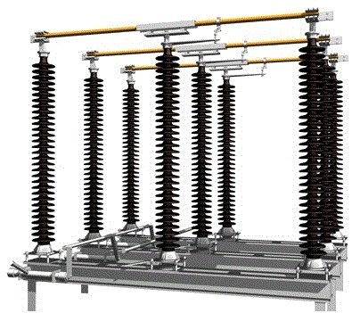
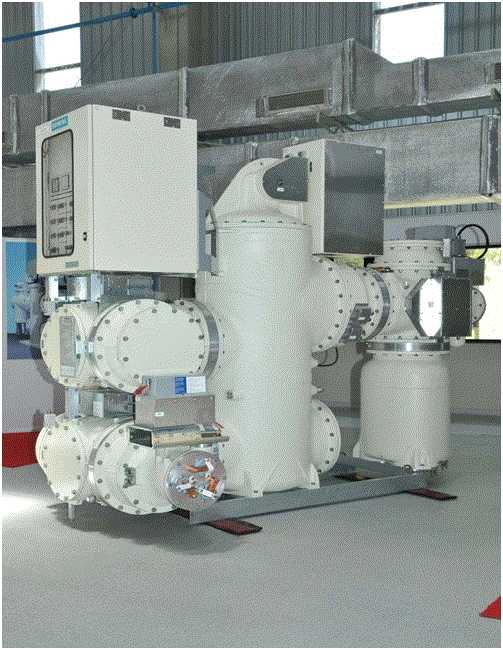
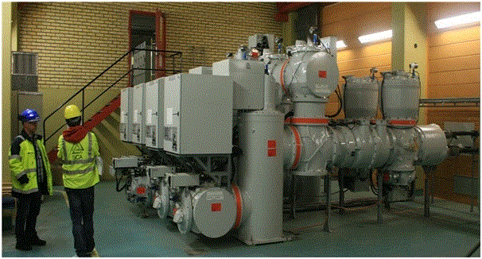

### <u>Control of Group Operated Switches (GOS) from workstation</u>

The group operated switches ( GOS ) located in the field can be monitored and remotely operated from the control centre. The GOS is coupled with a motor and this motor gets a command from the workstation and either opens or closes GOS accordingly. GOS is a part of switchgear. Let us see GOS and switchgear in detail :

<u>**Isolator switch (Group operated switches)**</u>

Isolators are known as disconnector or isolator switch. Isolator is used to make sure that anelectrical circuit can be completely de-energized for service or maintenance. Such switches are often found in electrical distribution and industrial applications where machinery must have its source of driving power removed for adjustment or repair. High-voltage isolation switches are used in electrical substations to allow isolation of apparatus such as circuit breakers and transformers, and transmission lines, for maintenance.  
Isolator switches have provisions for a padlock so that inadvertent operation is not possible . In high voltage or complex systems, these padlocks may be part of a trapped-key interlock system to ensure proper sequence of operation. In some designs the isolator switch has the additional ability to earth the isolated circuit thereby providing additional safety. Such an arrangement would apply to circuits which inter-connect power distribution systems where both end of the circuit need to be isolated.  
Isolators are manually operated or motorized. When the isolator is opened, it can be visually seen and hence service men are assured that is safe to work on the isolated equipment. The major difference between an isolator and a circuit breaker is that an isolator is an off-load device intended to be opened only after current has been interrupted by some other control device.

fig(a)
110kv isolator in closed position

<u>**Switch gear**</u>  
Switchgear is a term which covers wide range of equipment as regards switching and interrupting the currents in the power system during normal and abnormal conditions.

Or

The apparatus used for switching, controlling and protecting the electrical circuits and equipment is known as switchgear.

"switchgear" in general consists of:

<li>switches</li>
<li>fuses</li>
<li>circuit breakers</li>
<li>isolators</li>
<li>relays</li>
<li>control panels</li>
<li>metering panels</li>
<li>lighting arrestors</li>
<li>current transformers</li>
<li>potential transformers etc</li>

<u>**Functions of switchgear**</u>

<li>To localise the effects of faults by operation of protective equipment and so automatically disconnect faulty point from the system.</li>
<li>To break efficiently the short circuits without giving rise to dangerous conditions.</li>
<li>To facilitate the redistribution of loads, inspection and maintainance on the system.</li>

<u>**Essential features of switchgear**</u>

<li>Complete reliability</li>
<li>The switchgear must be able to discriminate between faulty and healthy sections.</li>
<li>Quick operation</li>
<li>Provision for manual control.</li>
<li>Provision for instruments.</li>

<u>**Principles of layout of switchgear**</u>

<li>The layout should be such that any section may be isolated without immoderately affecting the service.</li>
<li>There should be an easy and safe access for general routine inspection and for maintainance.</li>
<li>The individual units should be so designed that the risks of failure are reduced to minimum.</li>
<li>Fire protection arrangement must be made adequately.</li>
<li>To keep the breaking duty within the capacity of the circuit breakers, reactors should be used wherever necessary.</li>  
  
  

fig(b)

fig(c)

<u>**SF6 gas-insulated switchgear**</u>  
Gas-insulated switchgear (GIS) has become a major piece of substation equipment. Over the period, GIS has been improved by technological advancements that have increased the interrupting capacity of the circuit breaker (CB) and decreased the number of breaks per single CB without using an air condenser.
GIS offers high reliability, safety, and maintenance-free features in a much smaller space compared with conventional switchgear.

fig(d)

The SF6 GIS (fig(d)) guarantees outstanding advantages for the planning and operation of high-voltage supply networks. For instance , the space requirement can be less than 10% of the space taken up by an equivalent conventional installation.

fig(e)

As all live parts are metal enclosed and hermetically sealed, the SF6 GIS is completely immune to atmospheric pollution (fog, sand, salt, etc.) and industrial pollution (dust, smoke, gas, etc.). With SF6 GIS, all foreign bodies(persons, animals, and tools) are prevented from coming into contact with live parts. This ensures maximum safety to personnel and increased continuity of operation.

<u>**Main features:**</u>

<li><u>High reliability</u>: The live parts are sealed in metal enclosures filled with pure SF6 gas. Thus,the switch gear is protected from contamination by smoke, chemical fumes, dust or salt-laden spray or by the ingress of small animals.This protection prevents the inside components from oxidation and rust caused by oxygen and moisture.</li>

<li><u>Space reduction</u>: A medium-voltage GIS can be installed into a space about half that required for conventional air-insulated metal-clad switchgear.</li>

<li><u>High safety</u>: All the live parts are fully enclosed in grounded metal enclosures. Thus, there is no danger of an electrical shock.SF6 is an inert, non-flammable, nontoxic, and odourless gas used as an insulation and arc-extinguishing medium. Therefore, it is safe for personnel and there is no fire hazard.</li>

<li><u>Short installation time</u>: A GIS of about four panels can be transported fully constructed.The GIS can be energized by connecting external power cables to the prefabricated plug-in type terminals, thus shortening installation time.</li>

